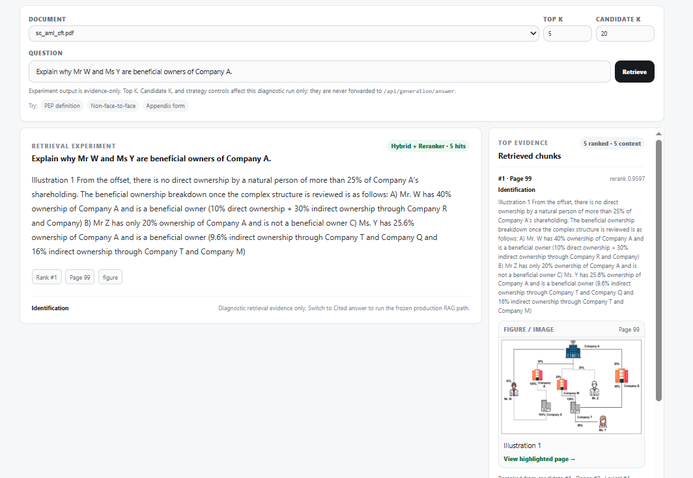
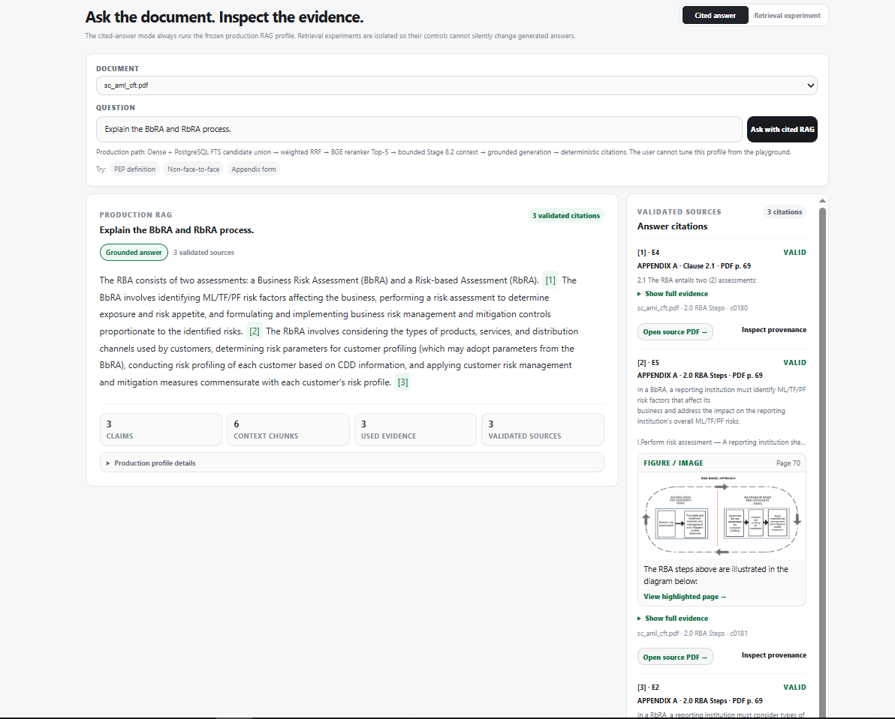
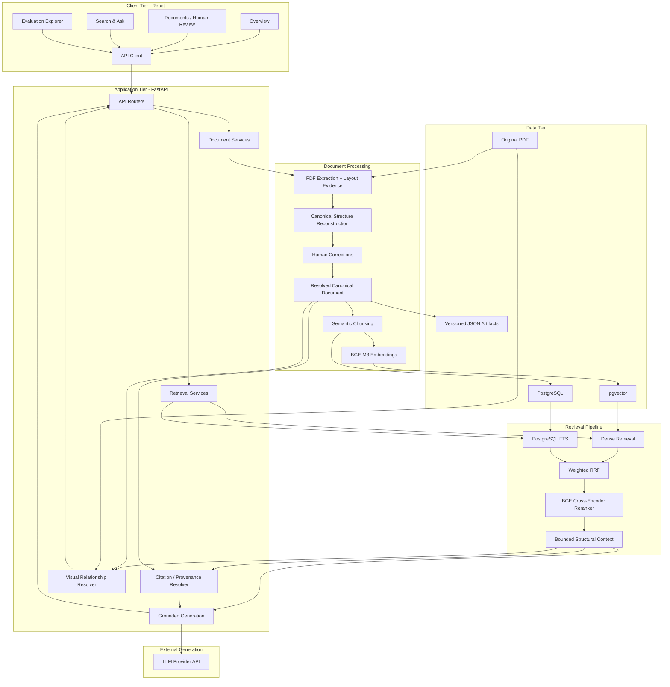
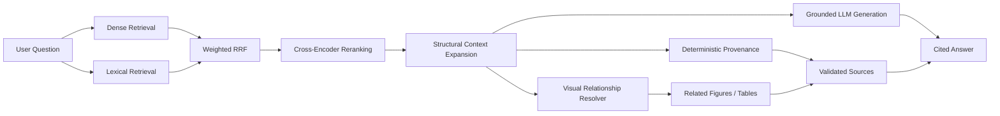

# RAG Document Studio

**A structure-aware, evidence-first RAG system for complex regulatory PDFs.**

RAG Document Studio is an end-to-end portfolio project that makes the full path from **PDF → canonical document structure → retrieval → cited answer → source provenance** inspectable. Instead of treating RAG as a single framework call, the project exposes the document-processing decisions, retrieval stages, supporting evidence, citations, figures, tables, and evaluation behind every answer.

> **Portfolio focus:** document intelligence, hybrid retrieval, grounded generation, deterministic provenance, evaluation, and human-in-the-loop correction.

## Why this project exists

Naive PDF RAG often reduces a document to plain text before chunking. That can destroy hierarchy, definitions, tables, figures, page relationships, and the context needed to answer regulatory questions reliably.

This project takes a different approach:

- preserve layout and provenance during extraction;
- reconstruct a canonical semantic document before chunking;
- allow non-destructive human correction of ambiguous structure;
- combine dense and lexical retrieval rather than relying on one retriever;
- rerank and expand context using bounded structural relationships;
- generate answers only from retrieved evidence;
- derive source citations from backend provenance rather than asking the LLM to invent page references;
- reconnect retrieved text to related figures and tables from the original PDF.

The primary benchmark document is a **109-page Securities Commission Malaysia AML/CFT/CPF guideline**. Results in this repository are document/domain-specific portfolio evidence, not claims of universal arbitrary-PDF performance.

---

## Product preview

### Retrieval inspection with same-page visual evidence



### Production cited answer with cross-page visual provenance



The current UI can also promote one strongly related cited figure/table into the answer panel while keeping the right-hand **Validated Sources** panel as the complete evidence record. In this Option-A implementation, the LLM still reasons from retrieved text; visual assets are presented as related source evidence rather than being interpreted by a VLM.

---

## What the system demonstrates

| Area | Implementation |
|---|---|
| Document ingestion | Deterministic PDF extraction with text, geometry, tables, page provenance, and layout evidence |
| Canonical structure | Definitions, clauses, headings, figures, tables, hierarchy, and relationships reconstructed before retrieval |
| Human review | Non-destructive correction workflow for structural/classification errors |
| Chunking | Structure-aware semantic chunks (`semantic-v2.1`) with source element provenance |
| Dense retrieval | `BAAI/bge-m3` embeddings stored in PostgreSQL/pgvector |
| Lexical retrieval | PostgreSQL Full-Text Search with content-term query formulation |
| Hybrid retrieval | Weighted Reciprocal Rank Fusion over dense + lexical candidate ranks |
| Reranking | `BAAI/bge-reranker-v2-m3` cross-encoder |
| Context assembly | Bounded one-hop structural evidence expansion |
| Generation | Evidence-bound answer generation with explicit abstention |
| Citations | Deterministic claim → evidence → chunk → canonical source → PDF provenance |
| Visual evidence | Figures/tables resolved from canonical relationships and rendered from the original PDF |
| Evaluation | Protected DEV/held-out retrieval and answer/citation evaluation |
| Product UI | React document workbench, Search & Ask, provenance inspection, and frozen Evaluation explorer |
| Deployment | Reproducible Docker Compose stack with PostgreSQL, pgvector, backend, migration, test, and frontend services |

---

## High-level architecture



### Query-time RAG flow



### Visual evidence trust boundary

Visual evidence is intentionally a **presentation/provenance layer** in the current version:

```text
Retrieved text chunk
      ↓
source_element_ids
      ↓
canonical figure/table relationships
      ↓
page + bounding box
      ↓
render crop from original PDF
      ↓
Validated Source / optional inline evidence
```

The visual itself is **not independently embedded or interpreted by a VLM**. This keeps the UI truthful about what the generation model actually used.

---

## Production retrieval profile

The frozen production profile is:

```text
embedding       BAAI/bge-m3
lexical         PostgreSQL FTS, OR content terms v1
fusion          weighted RRF (k=60, dense=1.0, lexical=1.0)
candidate_k     20 per retriever
reranker        BAAI/bge-reranker-v2-m3
seed top_k      5
context         structural_one_hop_v1
```

PostgreSQL FTS is intentionally **not described as BM25**.

---

## Evaluation results

### Retrieval held-out benchmark

Formal retrieval benchmark: **40 questions** — 25 DEV + 15 held-out.

| Metric | Dense | Hybrid | Hybrid + Reranker |
|---|---:|---:|---:|
| Hit@1 | 66.7% | 60.0% | **86.7%** |
| Hit@5 | 73.3% | **93.3%** | **93.3%** |
| Recall@5 | 70.0% | **90.0%** | 86.7% |
| MRR@10 | 0.7225 | 0.7189 | **0.8800** |
| CompleteEvidence@5 | 66.7% | **86.7%** | 80.0% |

Bounded structural context assembly reached **ContextRecall@5 90.0%** and **ContextCompleteEvidence@5 86.7%**.

The result illustrates the roles of the retrieval layers: hybrid retrieval improves candidate/evidence coverage, while reranking substantially improves the ordering of the best evidence.

### Answer and citation held-out benchmark

Independent held-out evaluation: **18 questions** — 15 answerable + 3 controls.

| Metric | Result |
|---|---:|
| Answer status accuracy | **94.44%** |
| Claim citation coverage | **100.00%** |
| Deterministic citation validity | **100.00%** |
| Required source coverage | **93.33%** |
| Fully supported claims | **95.83%** |
| Unsupported claims | **0.00%** |
| Citation entailment | **93.88%** |
| Answer completeness | **83.65%** |

The main remaining weakness is **completeness**, not unsupported hallucination. A grounded answer can still omit required information.

### Controlled retrieval experiment

A DEV-only experiment varied `candidate_k` while keeping the production retrieval profile frozen.

| candidate_k | Hit@1 | Recall@5 | MRR@10 | CompleteEvidence@5 | Avg request ms |
|---:|---:|---:|---:|---:|---:|
| 10 | 96.0% | 93.3% | 0.9800 | 88.0% | 844.1 |
| 20 | 96.0% | 93.3% | 0.9800 | 88.0% | 1302.3 |
| 40 | 96.0% | 93.3% | 0.9800 | 88.0% | 2131.0 |

Top-5 quality remained unchanged while candidate volume and runtime increased. This is engineering evidence only; production remains frozen at `candidate_k=20`.

---

## Technology stack

| Layer | Technology |
|---|---|
| Frontend | React 19, TypeScript, Vite, Nginx |
| Backend | Python 3.12, FastAPI, Pydantic |
| PDF processing | PyMuPDF, PyMuPDF4LLM / layout evidence |
| Embeddings | Sentence Transformers, `BAAI/bge-m3` |
| Reranking | `BAAI/bge-reranker-v2-m3` |
| Database | PostgreSQL 16, pgvector |
| Lexical search | PostgreSQL Full-Text Search |
| ORM / migrations | SQLAlchemy, Alembic |
| Generation | OpenAI-compatible provider API; Docker defaults to Groq |
| Deployment | Docker Compose |
| Testing | Pytest + frontend contract/build checks |

---

## Product workflow

The portfolio-facing navigation is intentionally compact:

```text
Overview | Documents | Search & Ask | Evaluation
```

### Documents

Inspect the document before retrieval:

```text
Overview | Content | Structure | Review | Knowledge | Search Index
```

The document workspace exposes extraction/layout evidence, canonical hierarchy, human correction, semantic chunks, and indexing status.

### Search & Ask

Two modes are available:

- **Cited answer** — frozen production RAG path with claims, validated citations, provenance, related visual evidence, and retrieval/context inspection from the same execution.
- **Retrieval experiment** — inspect dense, hybrid, or reranked evidence without calling the generation provider.

### Evaluation

The Evaluation view shows the **frozen benchmark artifacts**. It is intentionally separate from live Search & Ask so benchmark scores are not presented as live quality estimates for arbitrary uploads.

---

## Quick start with Docker

### Requirements

- Docker Engine / Docker Desktop with Compose
- NVIDIA Container Toolkit + compatible NVIDIA GPU for the default GPU-backed embedding/reranking services
- a configured generation-provider API key for fresh cited answers

```bash
# repository root
cp docker.env.example .env
```

Add your local configuration/secrets to `.env`, then:

```bash
docker compose up -d --build
```

Services:

```text
Frontend  http://localhost:5173
Backend   http://localhost:8000
Health    http://localhost:8000/health
```

For detailed WSL/local setup, see [`docs/development/LOCAL_SETUP.md`](docs/development/LOCAL_SETUP.md).

---

## Verification

Run the complete backend test service:

```bash
docker compose --profile verify run --rm backend-test
```

Focused visual-evidence regression:

```bash
docker compose --profile verify run --rm backend-test \
  python -m pytest -q \
  tests/test_visual_evidence.py \
  tests/test_visual_evidence_ui.py
```

Build the production frontend through Docker:

```bash
docker compose build frontend
```

Or locally with the repository-pinned Node/npm versions:

```bash
cd frontend
npm ci
npm run build
```

---

## Suggested demo queries

These queries exercise different parts of the system on the benchmark PDF:

```text
Explain why Mr W and Ms Y are beneficial owners of Company A.
```

Tests a **same-page figure relationship**.

```text
Explain the BbRA and RbRA process.
```

Tests a **cross-page relationship** from the explanatory text to the following RBA diagram.

```text
What are examples of risk factors and formulated parameters used in the business-based risk assessment?
```

Tests **structured table evidence**.

```text
How long must transaction records be retained?
```

Tests a normal **text-only answer** and helps detect inappropriate visual attachment.

A concise 5-minute portfolio walkthrough is available in [`docs/PORTFOLIO_DEMO.md`](docs/PORTFOLIO_DEMO.md).

---

## Repository layout

```text
ragProject/
├── backend/
│   ├── app/          FastAPI application and pipeline services
│   ├── alembic/      database migrations
│   ├── data/         document/runtime artifacts
│   ├── evaluation/   backend evaluation fixtures/config
│   ├── scripts/      verification/reproduction tools
│   └── tests/        regression and contract tests
├── frontend/         React/TypeScript product UI
├── docs/             architecture, retrieval, generation, evaluation, deployment docs
├── evaluation/       compact committed experiment evidence
├── docker-compose.yml
└── docker.env.example
```

---

## Documentation

Start with [`docs/README.md`](docs/README.md).

Key references:

- [`System Architecture`](docs/architecture/SYSTEM_ARCHITECTURE.md)
- [`Extraction and Canonical Structure`](docs/document-processing/EXTRACTION_AND_STRUCTURE.md)
- [`Human Review`](docs/document-processing/HUMAN_REVIEW.md)
- [`Semantic Chunking`](docs/document-processing/SEMANTIC_CHUNKING.md)
- [`Retrieval Architecture`](docs/retrieval/RETRIEVAL_ARCHITECTURE.md)
- [`Structure-Aware Context`](docs/retrieval/STRUCTURE_AWARE_CONTEXT.md)
- [`Grounded Generation`](docs/generation/GROUNDED_GENERATION.md)
- [`Deterministic Citations`](docs/generation/DETERMINISTIC_CITATIONS.md)
- [`Retrieval Benchmark`](docs/evaluation/RETRIEVAL_BENCHMARK.md)
- [`Answer & Citation Evaluation`](docs/evaluation/ANSWER_CITATION_EVALUATION.md)
- [`Controlled Experiments`](docs/evaluation/CONTROLLED_EXPERIMENTS.md)
- [`Portfolio Demo`](docs/PORTFOLIO_DEMO.md)
- [`Known Limitations`](docs/KNOWN_LIMITATIONS.md)

---

## Engineering decisions worth discussing in an interview

- **Why canonical reconstruction happens before chunking** rather than embedding extraction output directly.
- **Why dense and lexical scores are fused by rank** instead of numerically mixing incompatible score spaces.
- **Why reranking and structural context expansion are separate steps**.
- **Why citations are backend-derived** rather than generated as free-form page references by the LLM.
- **Why visual evidence is currently provenance-only** rather than pretending the model has multimodal understanding.
- **Why DEV and held-out evaluation are separated** to avoid tuning against final benchmark results.
- **Why the human correction layer is non-destructive**, preserving automatic extraction evidence and approved corrections separately.

---

## Scope and limitations

- The formal benchmarks are specific to the frozen SC AML/CFT/CPF document/domain.
- OCR and general scanned-PDF ingestion are not part of the frozen portfolio path.
- Exact pgvector cosine retrieval is appropriate for the current 284-chunk corpus; the project does not claim internet-scale ANN performance.
- Bounded structural context can miss distant dependencies.
- Visual evidence is **Option A**: related figures/tables are shown, but image-only meaning is not independently searchable yet.
- Fresh generation requires an external provider/API configuration.
- Multi-tenant serving, CI/CD, and production-scale distributed infrastructure are outside the current portfolio scope.

See [`docs/KNOWN_LIMITATIONS.md`](docs/KNOWN_LIMITATIONS.md) for the detailed boundary.

## Future work

The next meaningful extensions are intentionally kept outside the v1 portfolio scope:

- VLM-generated descriptions for image-only semantic retrieval;
- independent multimodal/image embeddings;
- generalized ingestion for broader PDF families and OCR-heavy documents;
- agent-assisted structural correction suggestions;
- multi-document collections and cross-document reasoning;
- production authentication, observability, CI/CD, and scalable vector indexing.

---

## Project status

**Portfolio v1: feature-complete.**

The priority now is reproducibility, documentation, demonstration, and clear communication of the engineering trade-offs rather than adding more architecture simply for feature count.
