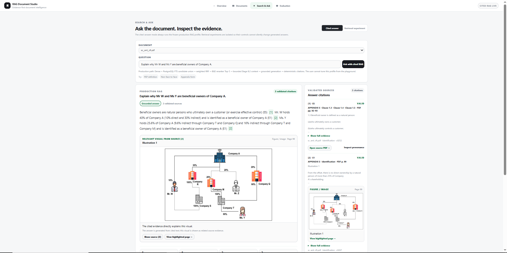
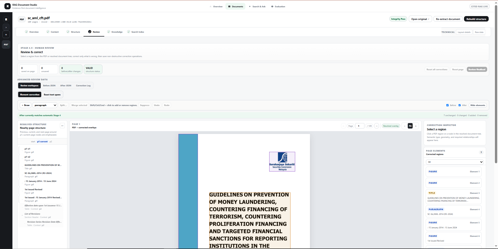
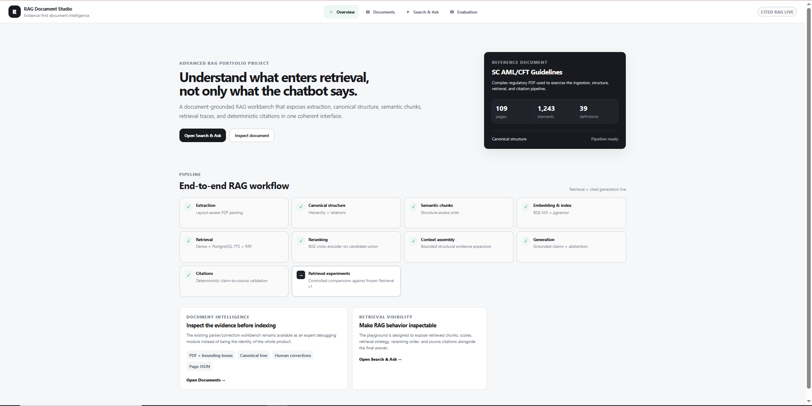
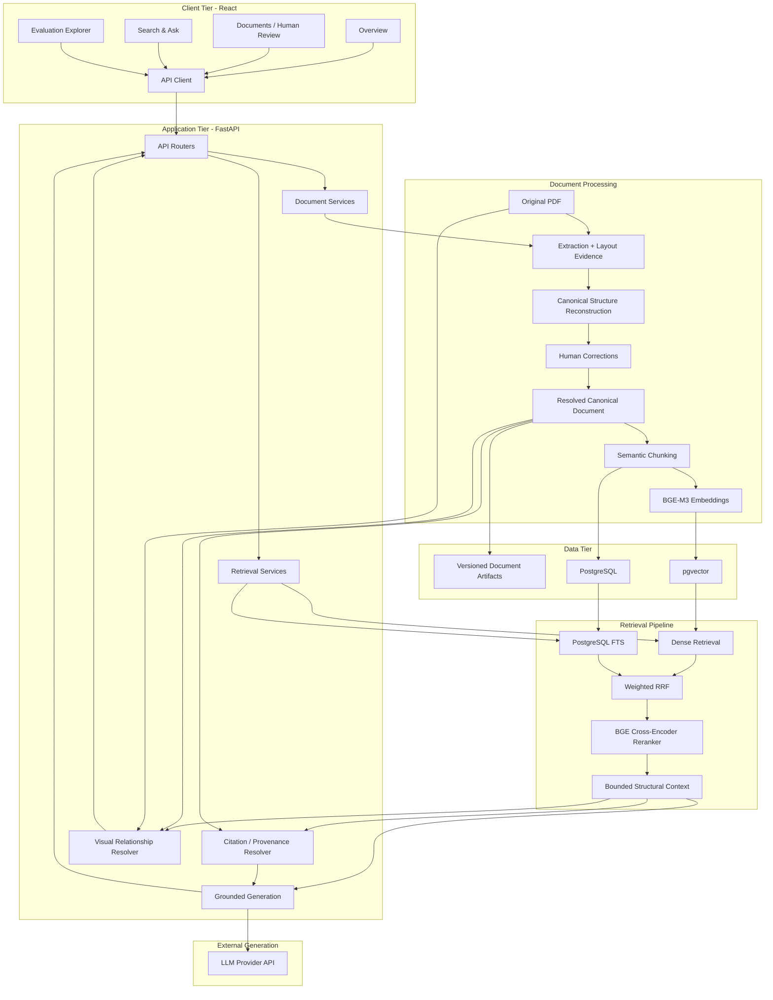
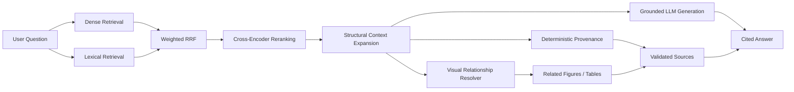

# RAG Document Studio

**Structure-aware Retrieval-Augmented Generation for complex regulatory PDFs.**

RAG Document Studio is an end-to-end RAG system that makes the full path from **PDF ingestion → document structure → retrieval → grounded answer → citation → original source evidence** inspectable.

Instead of flattening a PDF into plain text and hiding retrieval behind a framework call, the project preserves document structure, supports human review, combines dense and lexical retrieval, reranks evidence, derives citations deterministically, and reconnects retrieved text to related figures and tables in the original PDF.

> **Portfolio v1.0** · Document AI · Hybrid Retrieval · Grounded Generation · Provenance · Visual Evidence · Evaluation

---

## Product preview

### Cited RAG with inline visual evidence



The answer panel can promote one strongly related figure or table from a cited source while the **Validated Sources** panel remains the complete evidence record.

### Document workspace and human review



The document workspace exposes extracted content, reconstructed structure, corrections, semantic knowledge units, and indexing status before the document is used for retrieval.

### Product overview



---

## Why this project exists

Many PDF RAG examples follow a simple path:

```text
PDF → plain text → fixed-size chunks → embeddings → vector search → LLM
```

That approach can lose information that matters in regulatory and technical documents:

- heading and clause hierarchy;
- definitions and their scope;
- tables and structured rows;
- figure captions and explanations;
- cross-page relationships;
- exact page and bounding-box provenance.

RAG Document Studio instead builds a **canonical document representation before chunking and retrieval**.

```text
PDF
 ↓
Extraction + layout evidence
 ↓
Canonical structure reconstruction
 ↓
Human review / correction
 ↓
Structure-aware semantic chunks
 ↓
Dense + lexical retrieval
 ↓
Hybrid fusion + reranking
 ↓
Bounded structural context
 ↓
Grounded generation
 ↓
Deterministic citations + visual provenance
```

The primary benchmark document is a **109-page Securities Commission Malaysia AML/CFT/CPF guideline**. The benchmark results in this repository are therefore document/domain-specific evidence rather than claims of universal arbitrary-PDF performance.

---

## Key capabilities

| Capability | Implementation |
|---|---|
| PDF ingestion | Deterministic extraction with text, geometry, layout evidence, tables, and page provenance |
| Canonical structure | Headings, clauses, definitions, figures, tables, hierarchy, and relationships reconstructed before retrieval |
| Human-in-the-loop review | Non-destructive correction workflow for structural and classification errors |
| Semantic chunking | Structure-aware `semantic-v2.1` chunks with source-element provenance |
| Dense retrieval | `BAAI/bge-m3` embeddings stored in PostgreSQL/pgvector |
| Lexical retrieval | PostgreSQL Full-Text Search for exact terminology, clauses, acronyms, and regulatory wording |
| Hybrid retrieval | Weighted Reciprocal Rank Fusion over dense and lexical candidate ranks |
| Reranking | `BAAI/bge-reranker-v2-m3` cross-encoder |
| Context assembly | Bounded one-hop structural evidence expansion |
| Grounded generation | Evidence-bound answer generation with explicit abstention behavior |
| Citations | Deterministic claim → evidence → chunk → canonical element → PDF provenance |
| Visual evidence | Related figures/tables resolved from canonical relationships and cropped from the original PDF |
| Evaluation | DEV and held-out retrieval plus answer/citation evaluation |
| Product UI | React document workspace, Search & Ask, retrieval inspection, provenance inspection, and Evaluation explorer |
| Deployment | Docker Compose with PostgreSQL/pgvector, migrations, backend, frontend, and test services |

---

## Architecture



### Query-time RAG path



---

## Retrieval design

The frozen production retrieval profile is:

```text
embedding       BAAI/bge-m3
lexical         PostgreSQL FTS, OR content terms v1
fusion          weighted RRF (k=60, dense=1.0, lexical=1.0)
candidate_k     20 per retriever
reranker        BAAI/bge-reranker-v2-m3
seed top_k      5
context         structural_one_hop_v1
```

### Why dense + lexical retrieval?

Dense retrieval captures semantic similarity. Lexical retrieval is valuable for exact regulatory language such as:

- clause numbers;
- abbreviations;
- names and defined terms;
- exact phrases;
- uncommon domain terminology.

The two rank lists are combined using **Reciprocal Rank Fusion** rather than directly mixing incompatible raw score spaces.

### Why rerank after fusion?

The first retrieval stage is optimized for candidate coverage. A cross-encoder reranker then improves the ordering of the strongest evidence before context assembly and generation.

> PostgreSQL FTS is intentionally described as **Full-Text Search**, not BM25.

---

## Structure-aware document processing

The retrieval layer does not embed raw extraction output directly.

The processing pipeline first reconstructs a canonical representation containing elements such as:

```text
Document
├── Part / Section
│   ├── Heading
│   ├── Clause
│   │   ├── Subclause
│   │   └── Definition
│   ├── Table
│   └── Figure
└── Relationships
    ├── hierarchy
    ├── caption
    ├── introduction
    ├── explanation
    └── cross-page reference
```

A human reviewer can correct ambiguous classifications and relationships without destroying the original automatic extraction evidence.

This canonical layer is then used for semantic chunking, structural context expansion, citations, and visual provenance.

---

## Visual evidence and provenance

The current visual implementation is intentionally **Option A: provenance-linked visual evidence**.

```text
Retrieved chunk
      ↓
source_element_ids
      ↓
canonical figure/table relationship
      ↓
page + bounding box
      ↓
render crop from original PDF
      ↓
Validated Source / inline visual evidence
```

The visual relationship resolver can use strong signals such as:

- explicit figure/table references;
- figure introductions;
- captions;
- explanatory text;
- table-content relationships;
- bounded cross-page references.

It does **not** simply attach the nearest image to a retrieved paragraph.

### Important trust boundary

In v1.0, image pixels are **not sent to a VLM as part of answer generation**. The LLM reasons from retrieved textual evidence; related figures and tables are presented as supporting source evidence.

This distinction prevents the UI from implying multimodal understanding that the generation path did not actually perform.

---

## Deterministic citations

Citation provenance is resolved by the backend rather than asking the LLM to invent page references.

```text
Generated claim
      ↓
used evidence
      ↓
retrieved chunk
      ↓
source elements
      ↓
canonical document
      ↓
PDF page / region
```

This allows the UI to provide:

- validated citation status;
- source snippets;
- original PDF links;
- highlighted page regions;
- deep provenance inspection;
- related visual evidence.

---

## Evaluation

### Held-out retrieval benchmark

Formal retrieval benchmark: **40 questions** — 25 DEV + 15 held-out.

| Metric | Dense | Hybrid | Hybrid + Reranker |
|---|---:|---:|---:|
| Hit@1 | 66.7% | 60.0% | **86.7%** |
| Hit@5 | 73.3% | **93.3%** | **93.3%** |
| Recall@5 | 70.0% | **90.0%** | 86.7% |
| MRR@10 | 0.7225 | 0.7189 | **0.8800** |
| CompleteEvidence@5 | 66.7% | **86.7%** | 80.0% |

Bounded structural context assembly reached:

- **ContextRecall@5: 90.0%**
- **ContextCompleteEvidence@5: 86.7%**

The benchmark shows a useful separation of responsibilities: hybrid retrieval improves evidence coverage, while reranking improves the ordering of the best evidence.

### Held-out answer and citation benchmark

Independent held-out evaluation: **18 questions** — 15 answerable + 3 controls.

| Metric | Result |
|---|---:|
| Answer status accuracy | **94.44%** |
| Claim citation coverage | **100.00%** |
| Deterministic citation validity | **100.00%** |
| Required source coverage | **93.33%** |
| Fully supported claims | **95.83%** |
| Unsupported claims | **0.00%** |
| Citation entailment | **93.88%** |
| Answer completeness | **83.65%** |

The main remaining weakness in the frozen benchmark is **completeness**, rather than unsupported claims.

### Controlled retrieval experiment

A DEV-only experiment varied `candidate_k` while keeping the rest of the production retrieval profile fixed.

| candidate_k | Hit@1 | Recall@5 | MRR@10 | CompleteEvidence@5 | Avg request ms |
|---:|---:|---:|---:|---:|---:|
| 10 | 96.0% | 93.3% | 0.9800 | 88.0% | 844.1 |
| 20 | 96.0% | 93.3% | 0.9800 | 88.0% | 1302.3 |
| 40 | 96.0% | 93.3% | 0.9800 | 88.0% | 2131.0 |

Increasing the candidate pool did not improve top-5 quality in this DEV experiment, while request time increased. Production therefore remains frozen at `candidate_k=20`.

> These benchmark results belong to the frozen evaluation document and should not be interpreted as live quality estimates for arbitrary uploaded PDFs.

---

## Product workflow

The user-facing navigation is intentionally compact:

```text
Overview | Documents | Search & Ask | Evaluation
```

### Documents

```text
Overview | Content | Structure | Review | Knowledge | Search Index
```

Use the document workspace to inspect extraction/layout evidence, canonical hierarchy, corrections, semantic chunks, and index status before querying the document.

### Search & Ask

Two modes are intentionally separated:

**Cited answer**

Runs the frozen production RAG profile and returns:

- grounded generated answer;
- claim-level citations;
- validated sources;
- provenance;
- related figures/tables;
- retrieval/context inspection from the same execution.

**Retrieval experiment**

Allows retrieval-only inspection without silently changing the production answer profile.

### Evaluation

The Evaluation explorer displays frozen benchmark artifacts separately from live document querying so historical evaluation results are not confused with arbitrary-upload performance.

---

## Technology stack

| Layer | Technology |
|---|---|
| Frontend | React 19, TypeScript, Vite, Nginx |
| Backend | Python 3.12, FastAPI, Pydantic |
| PDF processing | PyMuPDF, PyMuPDF4LLM, PyMuPDF Layout |
| Embeddings | Sentence Transformers, `BAAI/bge-m3` |
| Reranking | `BAAI/bge-reranker-v2-m3` |
| Database | PostgreSQL 16, pgvector |
| Lexical retrieval | PostgreSQL Full-Text Search |
| ORM / migrations | SQLAlchemy, Alembic |
| Generation | OpenAI-compatible provider API; Docker configuration defaults to Groq |
| Deployment | Docker Compose |
| Testing | Pytest + frontend contract/build validation |

### Framework note

The core RAG path is implemented directly rather than hidden behind LangChain/LlamaIndex abstractions. This was intentional so retrieval, fusion, reranking, context assembly, evaluation, and provenance could be inspected and tested independently.

Framework adapters can be added without replacing the underlying retrieval architecture.

---

## Quick start

### Requirements

- Docker Engine / Docker Desktop with Compose
- NVIDIA Container Toolkit and a compatible NVIDIA GPU for the default GPU-backed embedding/reranking path
- generation-provider API credentials for fresh cited answers

Clone the repository and create the local environment file:

```bash
git clone https://github.com/Fahmie23/ragProject.git
cd ragProject
cp docker.env.example .env
```

Add your local secrets/configuration to `.env`, then build and start the stack:

```bash
docker compose up -d --build
```

Services:

```text
Frontend  http://localhost:5173
Backend   http://localhost:8000
Health    http://localhost:8000/health
```

For WSL/local development details, see [`docs/development/LOCAL_SETUP.md`](docs/development/LOCAL_SETUP.md).

---

## Verification

Run the complete Docker-backed test suite:

```bash
docker compose --profile verify run --rm backend-test
```

Run the focused visual-evidence regression suite:

```bash
docker compose --profile verify run --rm backend-test \
  python -m pytest -q \
  tests/test_visual_evidence.py \
  tests/test_visual_evidence_ui.py
```

Build the production frontend:

```bash
docker compose build frontend
```

Or use the repository-pinned local Node/npm versions:

```bash
cd frontend
npm ci
npm run build
```

---

## Suggested demo queries

These questions exercise different capabilities on the frozen benchmark PDF.

### Same-page figure relationship

```text
Explain why Mr W and Ms Y are beneficial owners of Company A.
```

### Cross-page visual relationship

```text
Explain the BbRA and RbRA process.
```

This exercises a relationship where explanatory text and its related RBA diagram span adjacent pages.

### Structured table evidence

```text
What are examples of risk factors and formulated parameters used in the business-based risk assessment?
```

### Text-only negative case

```text
How long must transaction records be retained?
```

This helps verify that unrelated visuals are not attached to ordinary text-only evidence.

A concise interview/demo walkthrough is available in [`docs/PORTFOLIO_DEMO.md`](docs/PORTFOLIO_DEMO.md).

---

## Repository structure

```text
ragProject/
├── backend/
│   ├── app/          FastAPI application and pipeline services
│   ├── alembic/      database migrations
│   ├── data/         local document/runtime artifacts
│   ├── evaluation/   evaluation fixtures/configuration
│   ├── scripts/      verification and reproduction tools
│   └── tests/        regression and contract tests
├── frontend/         React/TypeScript product UI
├── docs/             architecture, pipeline, evaluation, and deployment docs
├── evaluation/       compact committed experiment evidence
├── docker-compose.yml
└── docker.env.example
```

---

## Documentation

Start with [`docs/README.md`](docs/README.md).

Key references:

- [`System Architecture`](docs/architecture/SYSTEM_ARCHITECTURE.md)
- [`Extraction and Canonical Structure`](docs/document-processing/EXTRACTION_AND_STRUCTURE.md)
- [`Human Review`](docs/document-processing/HUMAN_REVIEW.md)
- [`Semantic Chunking`](docs/document-processing/SEMANTIC_CHUNKING.md)
- [`Retrieval Architecture`](docs/retrieval/RETRIEVAL_ARCHITECTURE.md)
- [`Structure-Aware Context`](docs/retrieval/STRUCTURE_AWARE_CONTEXT.md)
- [`Grounded Generation`](docs/generation/GROUNDED_GENERATION.md)
- [`Deterministic Citations`](docs/generation/DETERMINISTIC_CITATIONS.md)
- [`Retrieval Benchmark`](docs/evaluation/RETRIEVAL_BENCHMARK.md)
- [`Answer & Citation Evaluation`](docs/evaluation/ANSWER_CITATION_EVALUATION.md)
- [`Controlled Experiments`](docs/evaluation/CONTROLLED_EXPERIMENTS.md)
- [`Portfolio Demo`](docs/PORTFOLIO_DEMO.md)
- [`Known Limitations`](docs/KNOWN_LIMITATIONS.md)

---

## Engineering decisions

### Why reconstruct document structure before chunking?

Regulatory documents contain hierarchy and relationships that are easy to destroy when extraction output is immediately split by character count.

### Why not rely only on vector search?

Semantic retrieval is strong for conceptual similarity, but lexical retrieval is useful for exact clauses, defined terms, acronyms, names, and regulatory wording.

### Why rank fusion instead of mixing raw scores?

Dense similarity and PostgreSQL FTS produce different score spaces. Rank fusion avoids assuming those scores are numerically comparable.

### Why separate retrieval and reranking?

First-stage retrieval prioritizes candidate coverage; reranking prioritizes precision in the final evidence set.

### Why derive citations deterministically?

The generation model should answer from evidence, not invent its own mapping between claims and PDF locations.

### Why keep human correction non-destructive?

Automatic extraction evidence and approved corrections remain separately inspectable, making the document-processing path easier to debug and audit.

### Why isn't this called multimodal RAG yet?

The current system resolves text evidence to source figures and tables, but image pixels are not independently understood or retrieved by a VLM. Calling that multimodal reasoning would overstate the current implementation.

### Why not build the core around LangChain?

The project was designed to demonstrate the mechanics underneath RAG frameworks: chunk provenance, dense retrieval, lexical retrieval, fusion, reranking, context construction, citations, and evaluation. Framework integration is an adapter-level extension rather than a prerequisite for the core architecture.

---

## Scope and limitations

- Formal benchmarks are specific to the frozen SC AML/CFT/CPF document/domain.
- OCR-heavy/scanned-document ingestion is not part of the frozen portfolio path.
- Exact pgvector cosine retrieval is appropriate for the current small corpus; this project does not claim internet-scale ANN performance.
- Bounded structural expansion can miss distant document dependencies.
- Visual evidence is provenance-linked rather than VLM-interpreted.
- Images are not independently embedded or semantically searchable in v1.0.
- Fresh answer generation requires external provider credentials.
- Multi-tenant serving, distributed infrastructure, CI/CD, and large-scale observability are outside the current portfolio scope.

See [`docs/KNOWN_LIMITATIONS.md`](docs/KNOWN_LIMITATIONS.md) for the detailed boundary.

---

## Future work

The next meaningful extensions are intentionally kept outside the v1.0 core:

- LangChain adapter/example around the existing custom retriever;
- VLM-generated descriptions for image-only semantic retrieval;
- independent multimodal/image embeddings;
- broader PDF-family and OCR-heavy ingestion;
- agent-assisted structural correction suggestions;
- multi-document collections and cross-document reasoning;
- authentication, observability, CI/CD, and scalable vector indexing.

---

## Project status

**RAG Document Studio v1.0 — feature complete for the portfolio scope.**

The project is now focused on reproducibility, evaluation, documentation, and demonstrating the engineering trade-offs behind a reliable RAG system rather than adding features purely for feature count.
